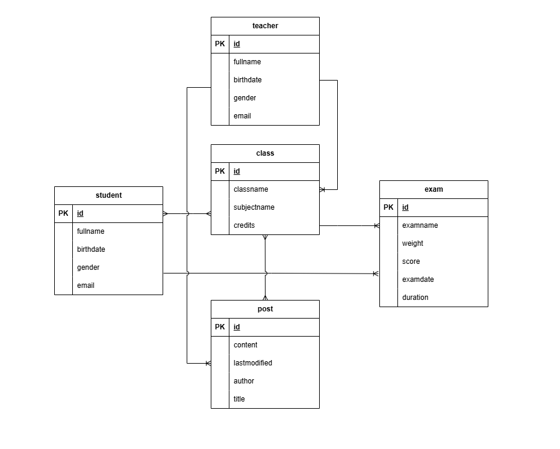

# schoolmng
## Build from docker
``
docker-compose up
``

## Sơ đồ mối quan hệ

## Mô tả

Ứng dụng web dùng để quản lý các đối tượng trong trường học bao gồm: teacher, student, class, exam, post.
Có thể tạo account với 3 role là ADMIN, STUDENT, TEACHER.

- STUDENT: 
  - Xem danh sách tất cá teacher.
  - View các class mà student đó đã được thêm vào.
  - View chi tiết các bài post, danh sách lớp, các bài exam của các lớp ở trên.

- TEACHER:
  - Xem danh sách tất cả teacher và student.
  - View các class mà student chịu trách nhiệm quản lý.
  - Được phép add/remove student với các lớp ở trên. Được thêm/xóa/sửa các bài exam và các posts trong các lớp trên.

- ADMIN:
  - Được phép thêm/xóa/sửa tất cả các object trong ứng dụng.

## Demo

https://drive.google.com/file/d/1qj0eZSNq75Z91-43QpGlKOuiJds2PNSh/view?usp=sharing
